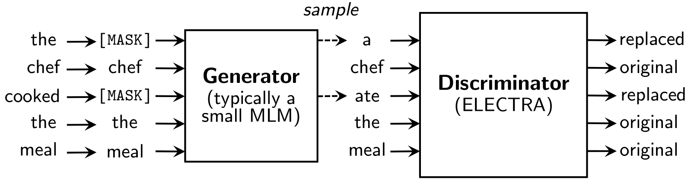
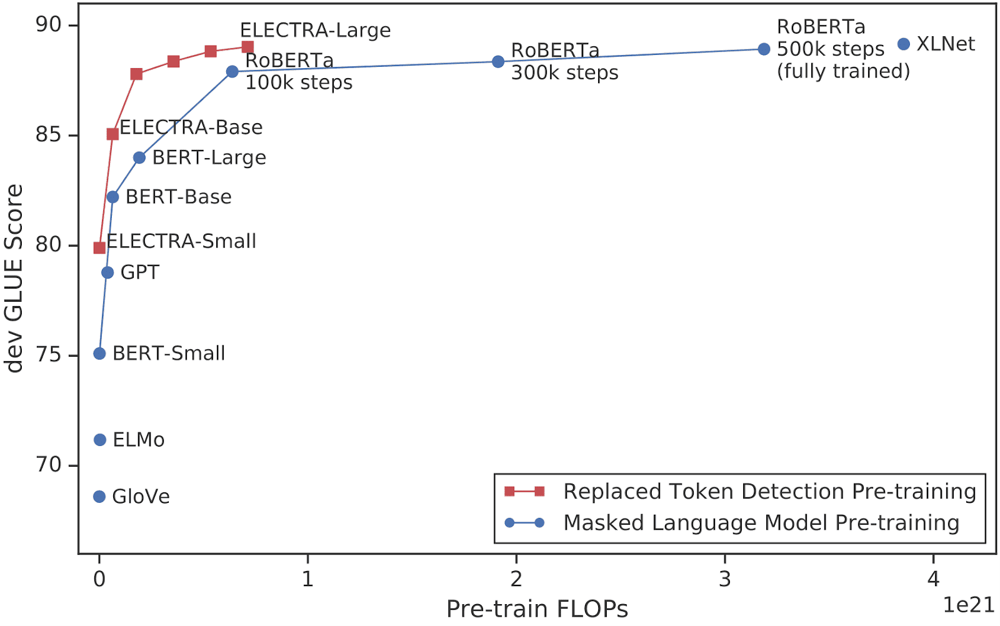

# What is this?
This repository contains a script that uses the ELECTRA model to perform binary text classification over tweets. The training examples consist of tweets about disasters and non-disaster tweets. You can find more details about this problem [here](https://ivanperez.pe/blog/nlp06-learning-from-kaggle-competitions).

ELECTRA is a flavor of BERT. It uses a different pre-training task called RTD: Replaced Token Detection. RTD trains a bidirectional model (like a Masked Language Model) while learning from all input positions (like a Language Model).

  
   
  Source: Google

This pre-training method outperforms existing techniques given the same compute budget.

  
   
  Source: Google

Read more about ELECTRA [here](https://github.com/google-research/electra).

# How can I use it?
A GPU is recommended to run this script. Also, you need to install several packages. As there are several ways to manage dependencies, I'm not providing a `requirements.txt` or `pyproject.toml` file. Please, check the script documentation to find out the requirements.

 The script will:
1. Gather the training data from `./data/train.csv`.
2. Create the `tf.data.Dataset` objects for the training, validation, and test datasets.
3. Define a preprocessing layer for ELECTRA.
4. Define and create the ELECTRA model.
5. Define a callback to calculate a custom metric (F1).
6. Finetune ELECTRA with the training data.
7. Generate predictions for the test dataset (`./data/test.csv`).

To run the script, follow next steps:
- Clone the repository
- Update the datasets path
- Install the requirements
- Run the script with `$ python classifier.py`
- Check the predictions in `./output/predictions.csv`

# Where can I learn more about NLP?
You can check [this repository](https://github.com/ig-perez/nlp-roadmap). Have fun! :)